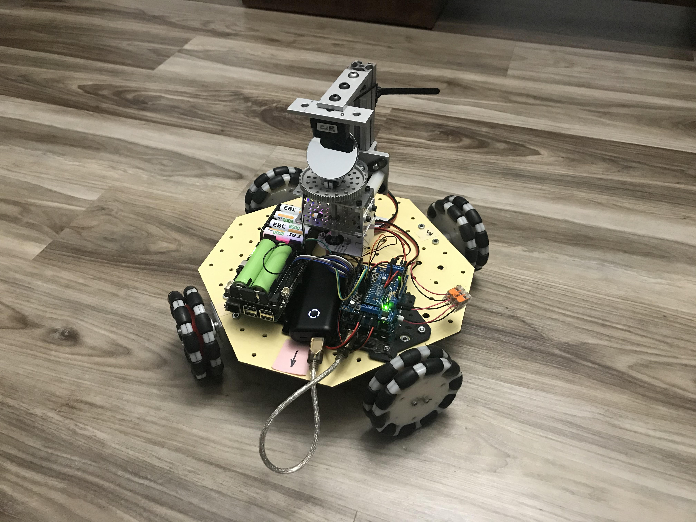

## Mapping LiDAR scan data
This project uses a Benewake TFMini Plus LiDAR module mounted to scan 180 degrees on a vertical axis. A hall effect angle encoder reports the angular position of the scan rotor.

### Rotating LiDAR mounted on a Zero Turn type car:

### Rotating LiDAR mounted on an Omni-Wheel type car:

The scan data are collected by a python program running on a Raspberry Pi 3B+.
The python program
* Collects data from the TFminiPlus on the serial port
* Collects readings from the angular encoder on the I2C bus
* Sends commands to the Arduino on the SPI bus
* Finds the best fit lines through the scan points
* Displays a plot of the points and the best fit lines.

The Arduino controls the motors through an Adafruit motor shield

[Things To Do Next](docs/ToDo.md)
