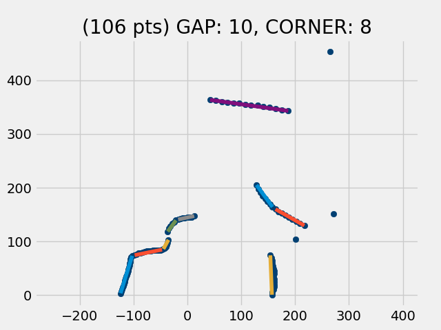

## Mapping LiDAR scan data
This project uses an Arduino UNO to collect scan data from a Benewake TFMini LiDAR module mounted to scan 180 degrees on a vertical axis.

The scan data are then transmitted via serial bus to a python program running on a Raspberry Pi 3B+.
The python program
* Initiates the scan by sending a command to the Arduino
* Listens on the serial port to collect the scan data 
* finds the best fit lines of the scan points
* displays a plot of the points and the best fit lines.

[Things To Do Next](docs/ToDo.md)
