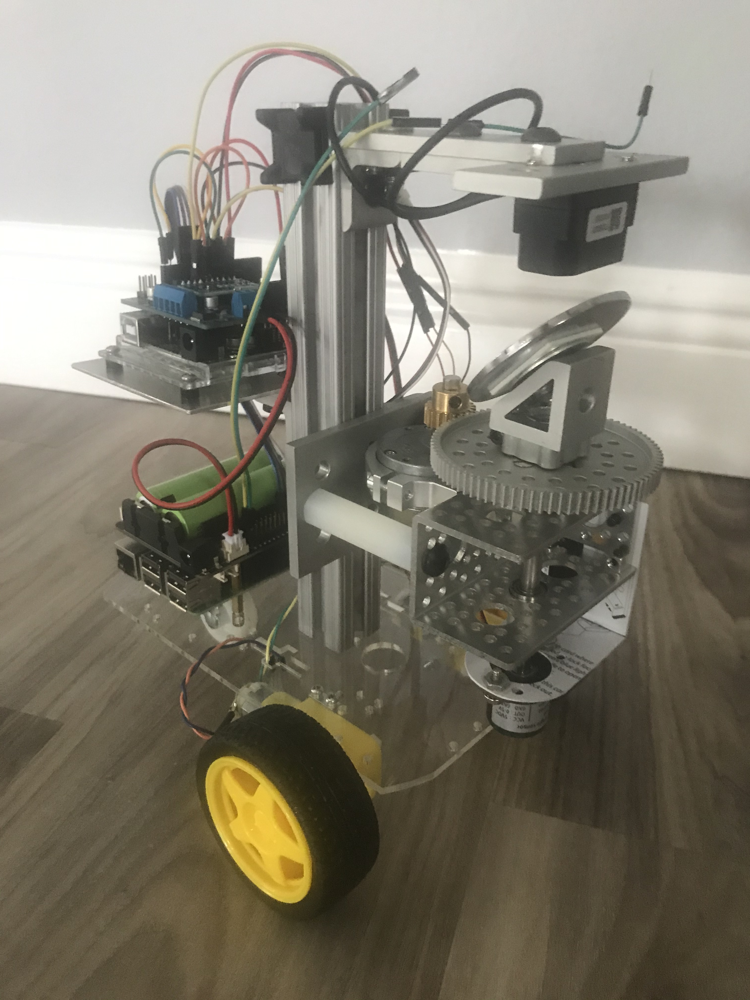
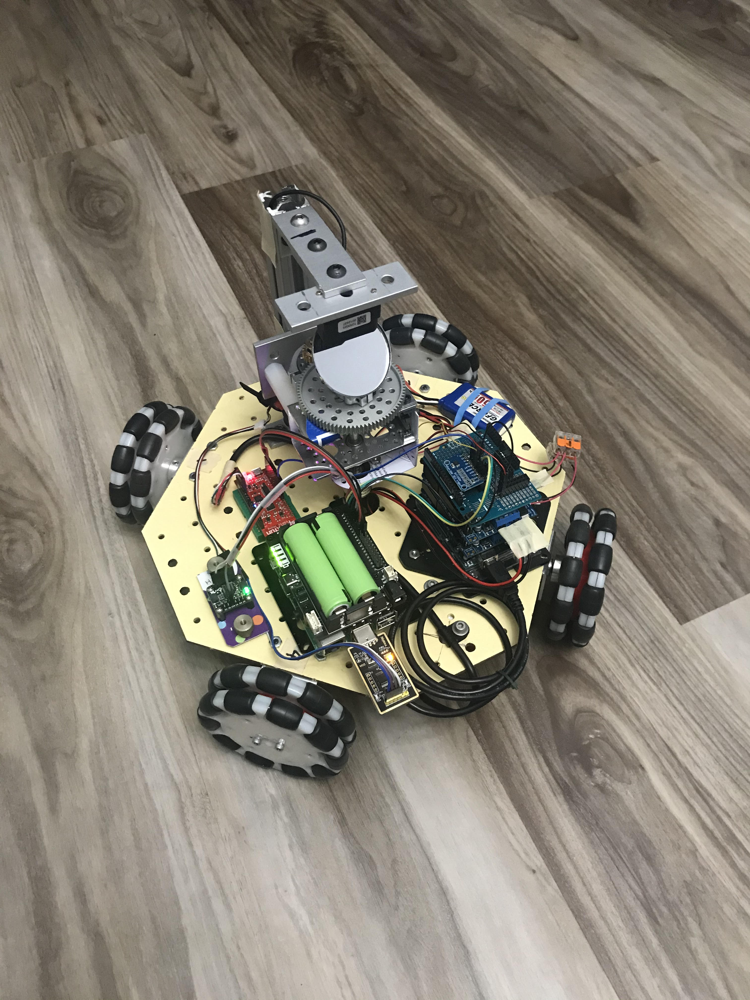
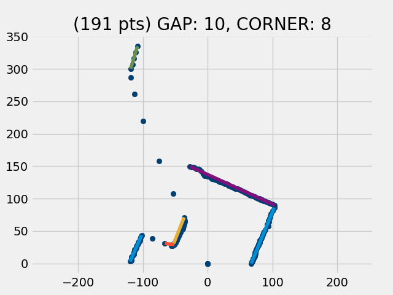

## Mapping LiDAR scan data
This project uses a Benewake TFMini Plus LiDAR module mounted to scan 225 degrees on a vertical axis. A hall effect angle encoder reports the angular position of the scan rotor.

### Rotating LiDAR mounted on a Zero Turn (early prototype) car:

### Rotating LiDAR mounted on an Omni-Wheel type car:

More about **Omni-Wheels** can be found [here](omni-wheels.md).

By using the scan data, the car can navigate autonomously,
able to make a [multi-leg trip](docs/triplog-21-05-16-06-00/trip_log.md) through the house.  
An onboard Raspberry Pi 3B+ runs a python program which:  
* Collects data from the TFminiPlus on a USB serial port
* Collects readings from the angular encoder via ADC (on I2C bus)
* Finds the best fit lines through the scan points
* Displays a plot of the points and the best fit lines.
* Using OpenCV, calculates the best path forward, avoiding objects in its environment
* Sends motor drive commands to the Arduino on the serial port  
  (Arduino controls the motors through an Adafruit motor shield)
* Keeps track of its position using data from an IMU and an odometer.
  * The IMU is an Adafruit BNO085 operating in RVC mode, sending data via serial
  * The odometer is a wheel mounted on the shaft of an incremental encoder,
    * Encoder data is collected by an ESP32 and sent to RasPi via ADC

