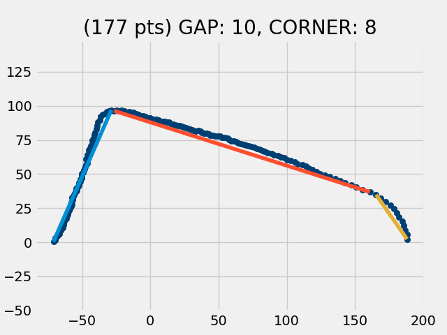
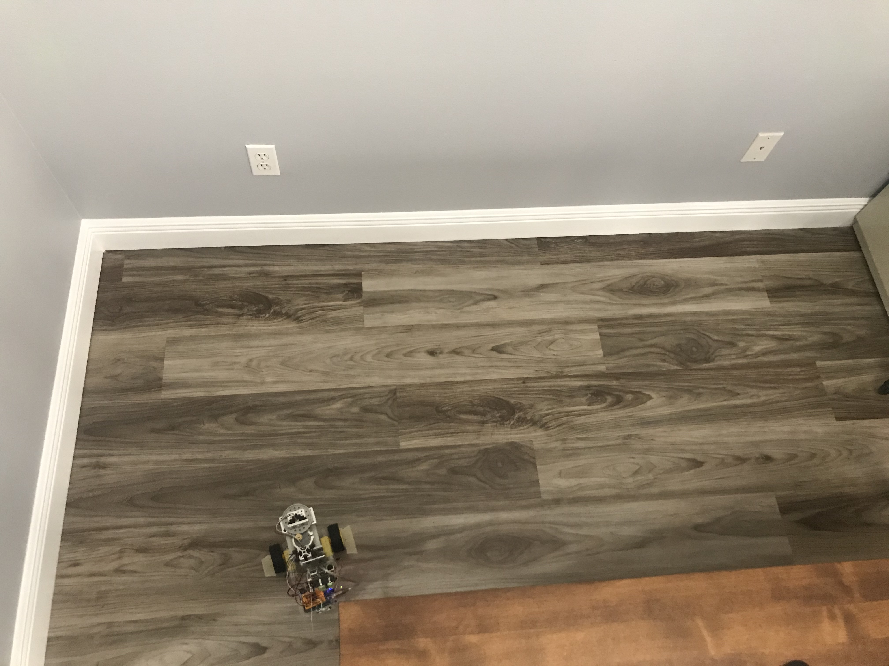

### Evaluation of Benewake TFMini Plus as a replacement for the TFMini
#### 11/9/2020
I purchased the TFMiniPlus and installed it to see if it would work even better than the TFMini. It didn't.
 
In the end, I went back to the TFMini. Here is what I learned:

When I collected scans, my Arduino program would send errors back over the serial bus. These errors would trip up the data collection by my Python program.
> TF Mini error: too many measurement attempts Last error: ERROR_SERIAL_BADCHECKSUM

I went online to see if anyone else had encountered this problem and I discovered a [fix](https://github.com/opensensinglab/tfmini/issues/9).

> In file TFmini.cpp line 140  
replace 2 with 1

```cpp
// Store running checksum
if (i < TFMINI_FRAME_SIZE-2) {
checksum += frame[i];
}
```
> Also, at 2 places (lines 158 & 159) change 8 to 7
```
uint16_t dist = (frame[1] << 8) + frame[0];
uint16_t st = (frame[3] << 8) + frame[2];
```
My Python program now starts to run (but doesn't finish).  
The Arduino still sends occasional errors (each reported on 3 lines) and sends far fewer data points.  
Here are the results of two successive scan attempts:
```
0 Hello from ZeroTurnCar
10 A
20 A
30 A
40 A
30 A
20 A
10 A
0 A
None
None
gap threshold =  10
corner threshold =  8
TF Mini error: too many measurement attempts
Last error:
ERROR_SERIAL_BADCHECKSUM
1, 50, 268
1, 50, 271
1, 51, 290
1, 51, 295
1, 52, 309
1, 54, 329
1, 55, 332
1, 56, 342
1, 60, 358
1, 61, 361
1, 65, 377
1, 68, 385
1, 69, 388
1, 72, 394
1, 77, 404
1, 88, 420
1, 106, 436
1, 107, 439
1, 104, 445
1, 100, 463
1, 97, 485
1, 97, 487
1, 96, 506
TF Mini error: too many measurement attempts
Last error:
ERROR_SERIAL_BADCHECKSUM
1, 1200, 539
1, 99, 558
1, 99, 561
1, 99, 563
1, 102, 574
1, 104, 585
1, 107, 591
1, 110, 599
1, 115, 613
1, 116, 615
1, 123, 626
1, 15, 650
1, 21, 656
1, 162, 667
1, 200, 689
1, 204, 692
1, 203, 695
1, 201, 698
1, 199, 701
1, 194, 711
1, 198, 725
1, 205, 728
1, 46, 735
1, 12, 736
1, 6, 739
1, 136, 741
1, 115, 744
1, 85, 762
1, 87, 764
Traceback (most recent call last):
  File "/home/pi/Desktop/ztcar_w_lidar.py", line 266, in <module>
    segments = find_segments()
  File "/home/pi/Desktop/ztcar_w_lidar.py", line 159, in find_segments
    str_dir, str_dist, str_enc_cnt = line.strip().split(', ')
ValueError: not enough values to unpack (expected 3, got 1)
>>> 
================= RESTART: /home/pi/Desktop/ztcar_w_lidar.py =================
0 Hello from ZeroTurnCar
10 A
20 A
30 A
40 A
30 A
20 A
10 A
0 A
None
None
gap threshold =  10
corner threshold =  8
1, 77, 279
1, 75, 293
1, 74, 298
1, 73, 309
TF Mini error: too many measurement attempts
Last error:
ERROR_SERIAL_BADCHECKSUM
1, 1200, 339
TF Mini error: too many measurement attempts
Last error:
ERROR_SERIAL_BADCHECKSUM
1, 1200, 375
1, 75, 380
1, 76, 388
1, 82, 418
1, 83, 423
1, 85, 428
1, 86, 431
1, 89, 442
1, 92, 447
1, 105, 471
1, 108, 474
1, 102, 493
1, 100, 498
1, 99, 500
1, 97, 506
1, 97, 509
1, 97, 511
1, 95, 514
1, 95, 517
1, 92, 528
1, 91, 536
1, 89, 544
1, 87, 560
1, 86, 571
1, 86, 573
1, 85, 579
1, 86, 598
1, 86, 604
1, 88, 628
1, 88, 631
1, 89, 634
1, 89, 639
1, 93, 662
1, 96, 670
1, 97, 673
1, 98, 678
1, 101, 687
1, 105, 695
1, 107, 697
1, 116, 714
1, 121, 719
1, 123, 722
1, 125, 724
1, 2, 730
1, 7, 736
1, 168, 761
Traceback (most recent call last):
  File "/home/pi/Desktop/ztcar_w_lidar.py", line 266, in <module>
    segments = find_segments()
  File "/home/pi/Desktop/ztcar_w_lidar.py", line 159, in find_segments
    str_dir, str_dist, str_enc_cnt = line.strip().split(', ')
ValueError: not enough values to unpack (expected 3, got 1)
```
It was at this point that I decided to go back to using the TFMini (and restore the TFMini.cpp file to its original state). Here is the output from a scan from the TFMini:
```
0 Hello from ZeroTurnCar
10 A
20 A
30 A
40 A
30 A
20 A
10 A
0 A
None
None
gap threshold =  10
corner threshold =  8
1, 71, 257
1, 70, 260
1, 70, 263
1, 69, 266
1, 68, 269
1, 67, 271
1, 67, 274
1, 66, 276
1, 66, 282
1, 65, 285
1, 65, 290
1, 65, 293
1, 65, 296
1, 65, 301
1, 65, 304
1, 64, 306
1, 64, 309
1, 64, 312
1, 64, 315
1, 64, 317
1, 64, 320
1, 64, 323
1, 64, 325
1, 64, 328
1, 64, 333
1, 64, 338
1, 65, 342
1, 65, 344
1, 65, 347
1, 66, 349
1, 66, 352
1, 66, 355
1, 66, 358
1, 66, 360
1, 66, 363
1, 67, 365
1, 67, 368
1, 67, 371
1, 67, 374
1, 68, 376
1, 68, 379
1, 69, 382
1, 69, 384
1, 70, 387
1, 71, 389
1, 71, 392
1, 72, 395
1, 72, 398
1, 73, 400
1, 74, 403
1, 74, 405
1, 77, 414
1, 77, 416
1, 79, 419
1, 79, 422
1, 81, 424
1, 82, 427
1, 83, 429
1, 84, 432
1, 86, 435
1, 87, 438
1, 89, 440
1, 90, 443
1, 92, 445
1, 94, 448
1, 96, 451
1, 97, 454
1, 99, 456
1, 100, 459
1, 100, 462
1, 101, 465
1, 101, 467
1, 101, 470
1, 100, 472
1, 100, 475
1, 99, 477
1, 99, 480
1, 98, 483
1, 97, 488
1, 97, 491
1, 96, 493
1, 96, 496
1, 95, 498
1, 94, 501
1, 93, 506
1, 93, 509
1, 92, 511
1, 91, 517
1, 91, 519
1, 90, 522
1, 90, 525
1, 90, 528
1, 90, 530
1, 89, 533
1, 89, 535
1, 89, 538
1, 89, 541
1, 89, 543
1, 88, 546
1, 88, 549
1, 88, 551
1, 88, 554
1, 88, 557
1, 88, 559
1, 88, 562
1, 88, 565
1, 88, 568
1, 88, 570
1, 88, 573
1, 88, 575
1, 88, 578
1, 89, 581
1, 89, 584
1, 89, 586
1, 89, 589
1, 90, 592
1, 90, 594
1, 90, 597
1, 91, 602
1, 91, 605
1, 92, 608
1, 93, 610
1, 93, 613
1, 94, 616
1, 95, 619
1, 95, 622
1, 95, 624
1, 96, 627
1, 97, 630
1, 97, 632
1, 98, 636
1, 99, 638
1, 100, 641
1, 101, 643
1, 102, 646
1, 103, 649
1, 104, 652
1, 105, 654
1, 106, 656
1, 107, 659
1, 108, 662
1, 110, 665
1, 111, 668
1, 113, 671
1, 114, 673
1, 116, 676
1, 117, 679
1, 119, 681
1, 121, 685
1, 122, 687
1, 125, 692
1, 127, 695
1, 128, 698
1, 130, 701
1, 132, 703
1, 134, 706
1, 137, 709
1, 140, 712
1, 143, 714
1, 146, 717
1, 149, 719
1, 153, 721
1, 156, 725
1, 160, 729
1, 165, 730
1, 169, 733
1, 172, 736
1, 175, 739
1, 178, 740
1, 180, 744
1, 182, 747
1, 183, 748
1, 185, 755
1, 186, 757
1, 187, 760
1, 188, 764
1, 188, 766
Number of data points =  177
Continuous regions:  [(0, 176)]
Look for corners, pass 1:
Regions:  [(0, 72), (73, 176)]
Look for corners, pass 2:
Regions:  [(0, 72), (73, 164), (165, 176)]
```



Below is a top view, showing how the robot was positioned w/r/t some nearby walls during the scan above.



Despite the manufacturer's claims of superior performance of the TFMiniPlus w/r/t/ the TFMini, those improvements were not evident in this test. In fact, the performance of the TFMiniPlus was miserable by comparison, sending only 51 points (compared with 177 ftom the TFMini) and sprinkling in some errors and bad readings (1200) as well.