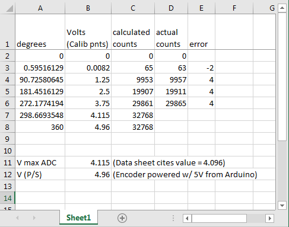

### Investigate use of ADS1115 ADC to collect angle encoder data

Started with [Adafruit ADS1x15 Library](https://learn.adafruit.com/raspberry-pi-analog-to-digital-converters/ads1015-slash-ads1115) to convert 0-5v signal from angle encoder to digital value and send it to the RasPi via I2C bus. This worked quite well. The Python program ads1115speedTest.py shows that encoder values can be received at rates easily exceeding the 100Hz speed of the TFminiPlus.
#### Calibration:

I conducted a calibration procedure in which the angle encoder was positioned at 90, 180, and 270 degrees. (Actually, I hooked up a meter to the output of the encoder and positioned it at 1.25V, 2.5V, and 3.75V) then used the python prgogram to get the encoder value.)
Along the way, I discovered a couple of  things:
* >One problem I discovered was that different 5V power supplies are not always exactly 5V.
When the Geekworm X728 UPS is plugged in and charging, the RasPi 5V level goes to 5.25V.
When it's unplugged it drops to more nearly 5V.
If an Arduino is hooked to the RasPi by USB, The Arduino 5V level is similarly affected, but not as severly. It goes from 5.1V when the X728 is charging to 4.95V when the charger is unplugged. 
* >I chose to use the Arduino power supply because it is the best one available. The [ADS1115 datasheet](https://cdn-shop.adafruit.com/datasheets/ads1115.pdf) explains that at its default settings, it converts a voltage between -4.096V and +4.096V to a number that ranges from -32768 to 32767. With these default settings, useful values are gotten in the desired angular range (90 degrees to 270 degrees).
* >Using the Arduino 5V supply (and with the charger unplugged) I manually moved the rotor to each of 3 positions: 1.25V, 2.50V, 3.75V and recorded the corresponding encoder count value. To achieve the best agreement between the measured encoder count value and the calculated encoder count value, I ended up fudging the 4.096 number to 4.115. See Excel file ang_encdr_calibr.xlsx  

