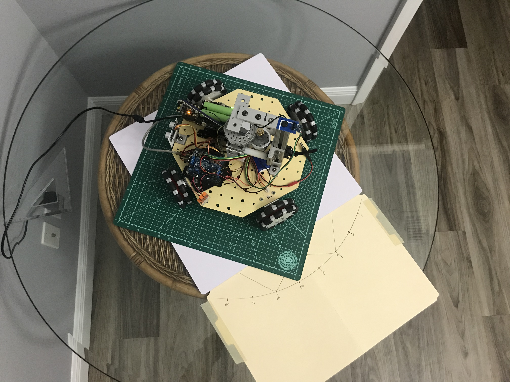
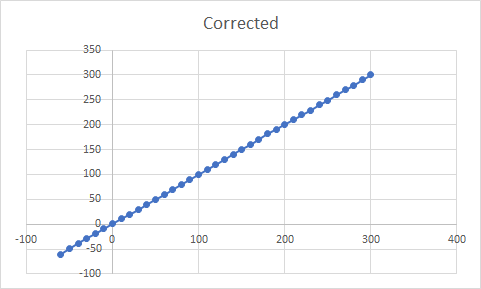
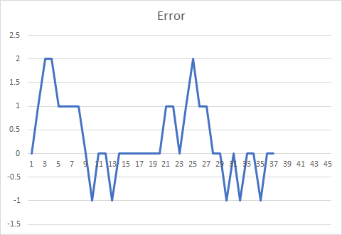

## Compass Calibration

I wanted to see if the uncorrected data I was getting from the HMC5883L device on the robot was in good agreemeent with the compass app on my phone. It wasn't. Here is what I found just looking at the cardinal directions:

Device	 | North | East | South | West
-------- | ----- | ---- | ----- | ----
TRUE     |   0   |  90  |  180  |  270
Phone    |   0   |  87  |  186  |  278
HMC5883L |  113  |  205 |  267  |  333

What I found was the values from the HMC5883L device were absolutely horrible and the phone was actually pretty far off too (although nowhere near as bad).

Next, I set up a turntable and collected data at 10 degree intervals. I used my phone to set the North diection, then placed the robot on the turntable as shown in the picture below.

I used this setup to collect values from the HMC5883L every 10 degrees. 

True     | Compass
--------- | --------
-60 | 6
-50 | 21
-40 | 37
-30 | 57
-20 | 76
-10 | 96
0 | 114
10 | 129
20 | 141
30 | 152
40 | 163
50 | 173
60 | 181
70 | 190
80 | 198
90 | 206
100 | 213
110 | 220
120 | 227
130 | 234
140 | 241
150 | 248
160 | 254
170 | 261
180 | 268
190 | 274
200 | 281
210 | 287
220 | 294
230 | 301
240 | 309
250 | 316
260 | 325
270 | 334
280 | 343
290 | 354
300 | 6
310 | 21
320 | 37
330 | 57
340 | 76
350 | 96
360 | 114

I then used [Excel](compass_data.xlsx) to plot the data and discovered that it was pretty non-linear. Empirically, values were found for the magnitude and phase of a sine wave that did a pretty good job of linearizing the data. By subtracting the sine wave and an additional fixed offset, the HMC5883L data could be corrected to a point where it was within a degree or two of the "True" direction over the entire range of values. 

