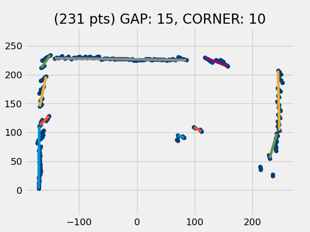
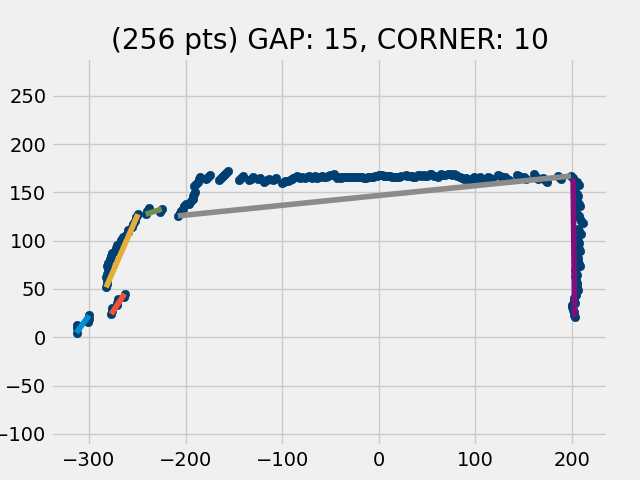

## Lidar / Mapping Performance

The omni-wheel car has reached a state of functionality making it possible to now benchmark its performance.

### Test 1 Under the Piano

In this test, the car has been placed under the grand piano, looking squarely at the window wall. Of the 3 piano legs, only the two legs under the keyboard (to the right) are within the 180 degree scan area. The third leg is not in the scan area. It is located below the -X axis. Also, the piano bench has been removed, as has the dining chair from the upper left corner of the room. The only other furniture remaining in the room is the semi-circular table on the wall at left. (Its effect can be seen as a disruption of the left wall.)



This image was produced with the following code:
```
import omnicar
import proscan

car = omnicar.OmniCar()
time.sleep(0.5)
data = car.scan(spd=90)
print(f"total number of points: {len(data)}")
save_scandata_as_csv(data, 'scan_data.csv')
pscan = proscan.ProcessScan(data, gap=15, crnr=10)
pscan.map(nmbr=1, display_all_points=True)  
car.close()
```

Several things can be noticed in the image:
* The walls of the room are straight and square with the grid, indicating that the values of LEV, MEV and HEV are reasonably accurate. (If the values were sustantially off, the rectangular layout of the room would would appear to be rotated slightly from the grid.)
* The dimensions of the room are accurate.
* The pedal lyre is big enough to be visiblle in the scan and it (obviously) occludes the wall of the room behind it.
* The two legs under the keyboard however are not visible in the scan, but they still disrupt the wall behind them.

It should be appreciated that foreground features are a big problem for the task of mapping the walls. Even if they are too small to show up on the scan, they still spoil the ability to get good data on a large area of wall behind, consideraably larger than just their shadow.

### Test 2  Living Room Double Door

In this next test, there is nothing in the foreground to block the view of the walls. It is in the living room, looking squarely at the closed double door to the study.



Observations from this image:
 * Again, the scan dimensions are within a couple of cm of the values gotten from the Stanley FatMax laser measuring device.
* The small amount that the doors are recessed in the wall straight ahead is visible.
* Also visible in the wall straight ahead, notice tht at oblique angles (>30 degrees), the lidar tends to not report small changes in distance, but rather repeats the previous distance again. Hmm... I should test this to see if this is due to the granularity of the ADC or if it has more to do with the size of the light beam (in which case a laser might give better results).
* Although the data looks solid, the corner finding algorithm needs work.
* The 45-degree wall at left with recessed (closed) door looks pretty accurate.
* Notice that at the end of scan (HEV), the data points don't get all the way down to the X axis. Need to find out why this is.