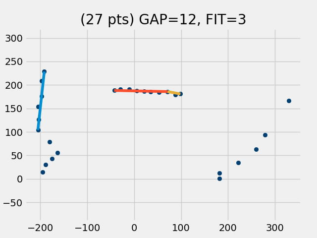
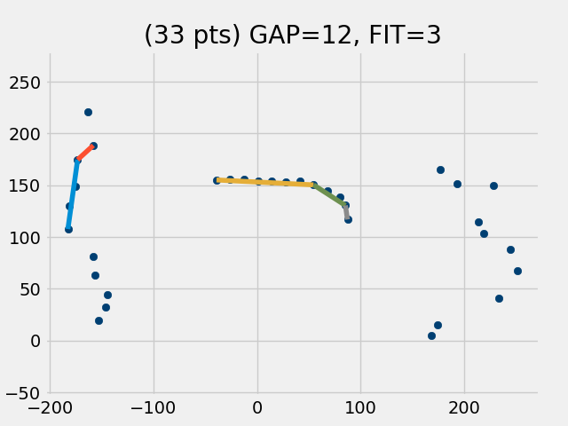
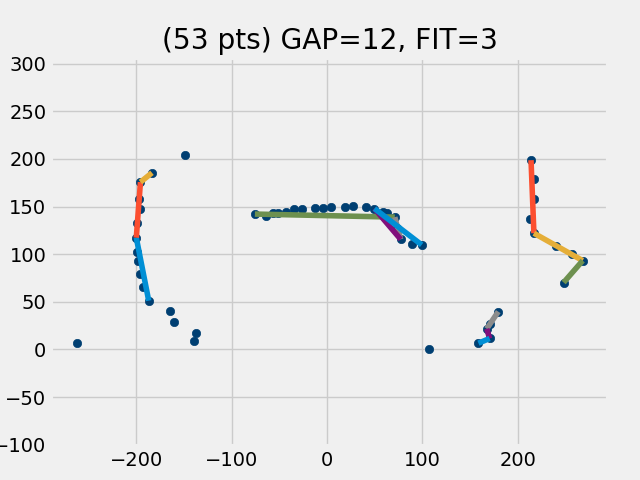
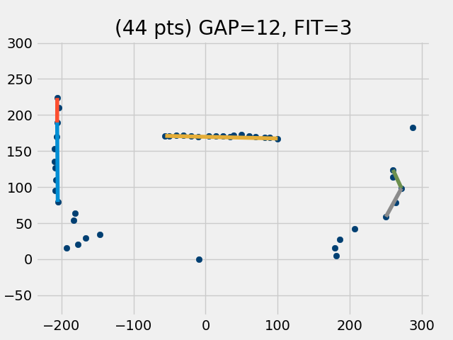
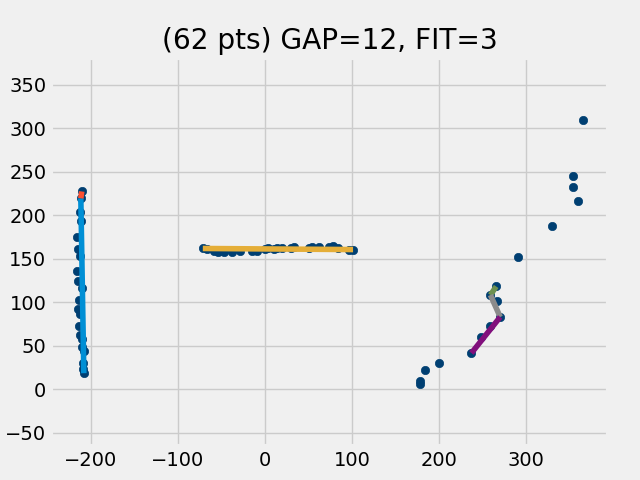

## Lidar issues

I have the TFmini Plus LiDAR module (model/serial: T250025 0012937) attached to the Raspberry Pi model 3B+ using the Python 3 code found at [Interfacing TFmini Plus LiDAR with Raspberry Pi 4B](https://github.com/ibrahimqazi/TFmini-Plus-LiDAR-interfacing-with-Raspberr-Pi).

Initially, I have the LiDAR module attached to a USB serial adapter which uses serial port /dev/ttyUSB0.

Scanning is accomplished by mounting a tilted mirror on a rotor which is made to spin about a vertical axis. This allows the LiDAR module to be mounted in a fixed position. An angle encoder mounted on the rotor axis provides directional data.

Below are the first 21 lines of data collected (There are actually 109 lines in the entire 180 degree scan). Each line has 2 values: the encoder value and the distance in cm measured by the LiDAR.

```
10521,0
10708,196
10888,196
11063,196
11209,191
11425,191
11598,191
11781,180
11949,180
12142,180
12320,173
12498,173
12678,173
12852,197
13035,197
13192,230
13390,230
13574,230
13752,239
13936,239
14124,239
```
Notice that the encoder values go up steadily, but the distance values change only every 3rd line (occasionally 2nd line). The result is that only about 1/3 of the data is meaningful. I end up throwing away almost 2 of every 3 data points. After throwing out the redundant points (and points that have distance values of 0 or 1200), the plot below is generated. Notice that it has only 27 points.



So what could be causing the LiDAR to give these redundant values? Maybe it is the LiDAR module itself. So I replaced the module with a newer one (model/serial: T260051 0011907). Here are the first 20 lines of scan data  (also 109 lines long). Looks like it has the same problem with triplets and the occasional twin.

```
10486,0
10667,0
10821,0
11033,154
11216,154
11406,154
11588,150
11771,150
11951,150
12130,151
12310,151
12482,151
12662,169
12841,169
12994,169
13203,178
13406,178
13595,212
13795,212
13989,212
```

From the data above, it is clear that this did not remedy the data triplet problem. Not surprisingly, the resulting plot shows a similar reduction of the number of data points. 



OK, changing to a newer module didn't solve the problem. Maybe the problem is being caused in transit on the serial bus. 

To explore this, I modified my setup to connect the TFmini Plus to the Raspberry Pi's builtin UART on pins 6 & 8 (instead of the USB Serial adapter).

Here are the first 20 lines of scan data (total = 107 lines this time). Now there are no data triplets (but there are lots of twins).
```
10570,263
10784,140
10978,139
11178,139
11365,163
11550,163
11732,170
11918,170
12099,194
12282,204
12473,204
12649,212
12841,212
13029,219
13199,219
13406,224
13588,232
13774,232
13952,239
14137,239
```
This makes a very noticeable difference in the resulting plot. 



Unfortunately however, the **shapes** of the scanned objects are distorted in the above plot. For example, the object that lies straight ahead of the scanner (on the vertical grid line labeled '0') is distorted. It is the back of a sofa and it is actually straight. So now I want to replace the LiDAR module with the original one, but still leave it attached to the RasPi's built-in serial port. Below is shown the resulting plot. This is how the back of the sofa is **really supposed to look**. Notice also that the wall at the left is straight. It is supposed to be straight. Apparently there is something going on with the new LiDAR module that is not quite right.



## Problem Found (and resolved)!

#### The problem

Looking at the raw scan data shows the problem is being caused by reading the serial bus **too frequently and whether or not there is new data available to be read**. And to make matters worse, every time the method is called, the input buffer is reset, further delaying the acquisition of new data.

#### The solution

The read_dist method has now been revised to wait until 9 bytes have accumulated on the input buffer, then it reads the data. The input buffer is not reset so no data is thrown away. Below is a scan with the new read_dist method, using the original LiDAR module, attached to the USB serial port. This is actually a pretty accurate representation of the room.



```    def read_dist(self):
        """Set self.distance = distance (cm) read from lidar module.
        Return number of bytes waiting on serial port when read.
        """
        # Prior to first read, purge buildup of 'stale' data
        if ser1.in_waiting > 100:
            ser1.reset_input_buffer()

        # Wait for serial port to accumulate 9 bytes of 'fresh' data
        while ser1.in_waiting < 9:
            time.sleep(.0005)

        # Now read 9 bytes of data on serial port
        counter = ser1.in_waiting
        bytes_serial = ser1.read(9)
        if bytes_serial[0] == 0x59 and bytes_serial[1] == 0x59:
            self.distance = bytes_serial[2] + bytes_serial[3]*256
            #self.strength = bytes_serial[4] + bytes_serial[5]*256
            #temperature = bytes_serial[6] + bytes_serial[7]*256
            #self.temperature = (temperature/8) - 256
        return counter
```