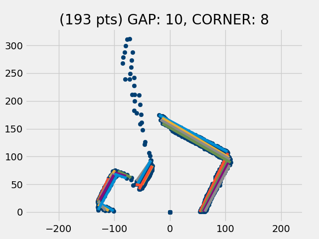

## Can image flow analysis of consecutive scans be used instead of encoders to keep track of robot position?
### 11/23/2020

The image above shows 4 scans overlayed as the robot is advanced through 4 positions along the Y axis spaced roughly 2 inches apart. The units on the X and Y axes are in cm, by the way.

The question is: Can we do an **image flow analysis** (similar to the way an optical mouse works) to make a reasonable calculation of the change in the robot's position as it advances from one position to the next.

It looks as though it should be possible. This would simplify the robot as it would be unneccesary to keep track of its position using the usual encoders and/or stepper motors.