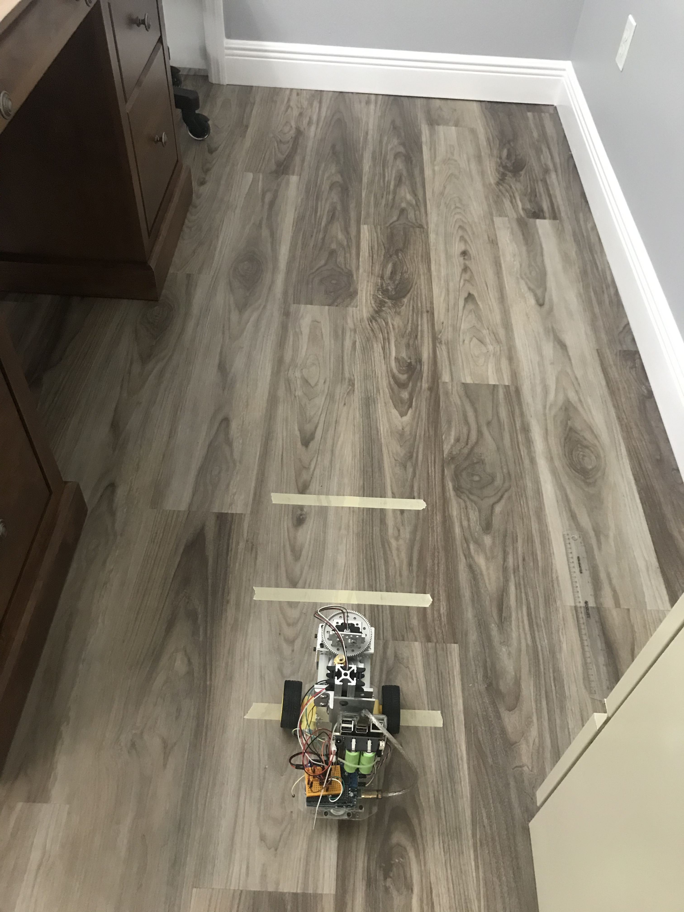
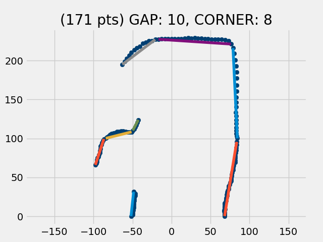
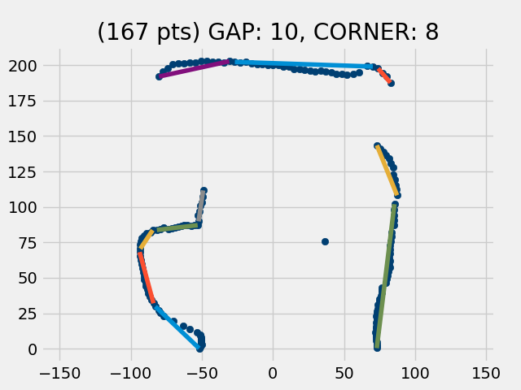
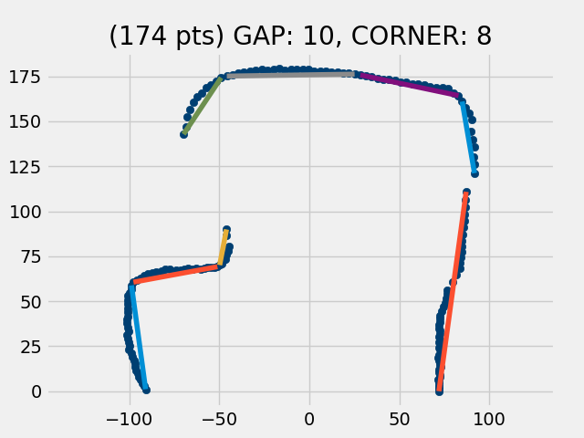
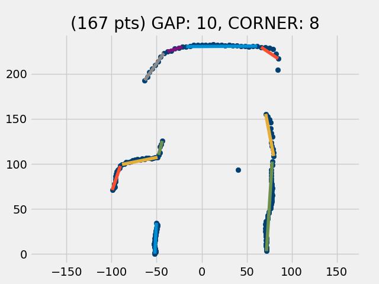
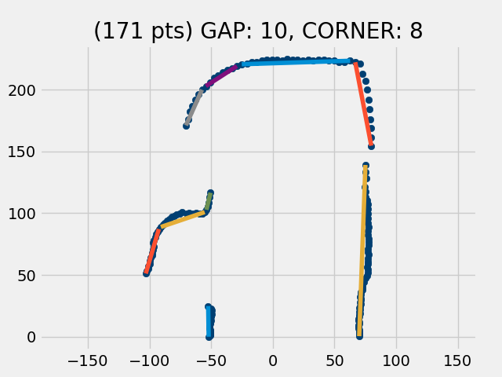

## Can image flow analysis of consecutive scans predict robot position?
### 11/9/2020

The image above shows the robot parked at position 0, with its wheels on the first of 3 stripes (spaced 20cm apart).
At each position (0, 20, 40), a scan is done and the resulting scan maps are shown below.

> The question is: Can we do an image flow analysis (similar to the way an optical mouse works) to make a reasonable calculation of the change in the robot's position as it advances from one position to the next.

## Successive Scan Maps at 20 cm spacing

### Scan Map at Position 0

### Scan Map Position 20

### Scan Map Position 40

My first impression from looking at these scan maps is that using a 20cm separation between successive scans might be fine for navigation purposes, but it is probably about an order of magnitude too big image flow analysis. I expect I would get much more encouraging results using a scan separation of around 3cm. With 20cm separation, the shapes morph and move, whereas with 3cm spacing, I expect they would mostly just move.

## Successive Scan Maps at 3 cm spacing

### Scan Map at Position 0

### Scan Map Position 3

### Scan Map Position 6

From what I see in this series, it looks like it would probably make sense to just use the data points that are part of continuous regions. Ignore data points that are all by themselves and ignore lines. Basically, just look at chains of "clumped" points and compare those from one scan to the next to see if image flow analysis yields a reliable estimate of robot motion.