## Log for Trip started Sun May 16 06:00:17 2021.  
  
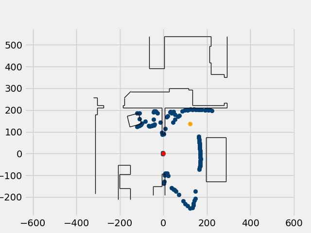  
Leg 1  
Starting Coords: (0, 0)  
Turning Left 48.0 deg to heading -48.01  
Heading after turn: -48.57 deg.  
Distance to target: 184.0 cm.  
Distance driven: 176 cm.  
Heading after drive: -48.230000000000004 deg.  
Ending Coords: (118, 130)  
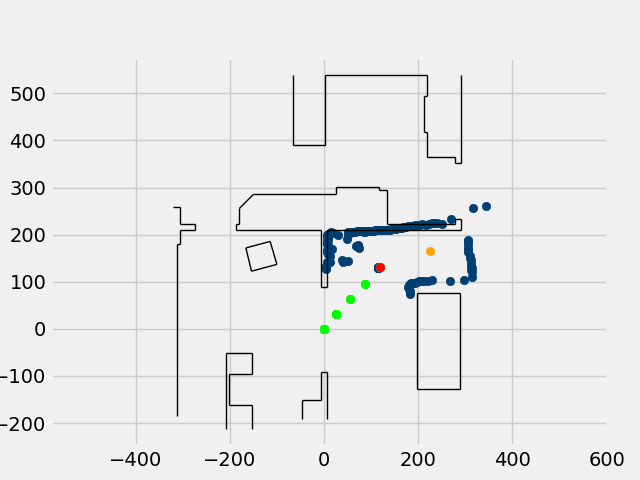  
Leg 2  
Starting Coords: (118, 130)  
Turning Right 29.999999999999996 deg to heading -18.250000000000004  
Heading after turn: -16.65 deg.  
Distance to target: 112.0 cm.  
Distance driven: 115 cm.  
Heading after drive: -13.56 deg.  
Ending Coords: (228, 163)  
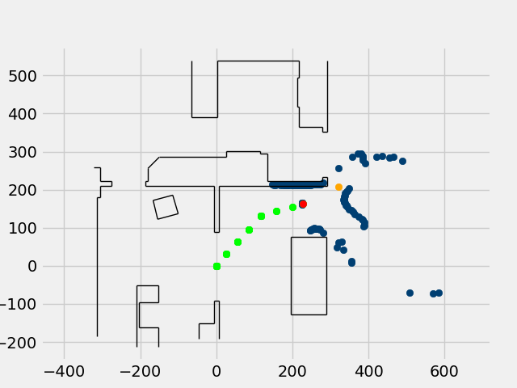  
Leg 3  
Starting Coords: (228, 163)  
Turning Left 11.999999999999998 deg to heading -25.57  
Heading after turn: -23.740000000000002 deg.  
Distance to target: 103.0 cm.  
Distance driven: 103 cm.  
Heading after drive: -21.94 deg.  
Ending Coords: (322, 205)  
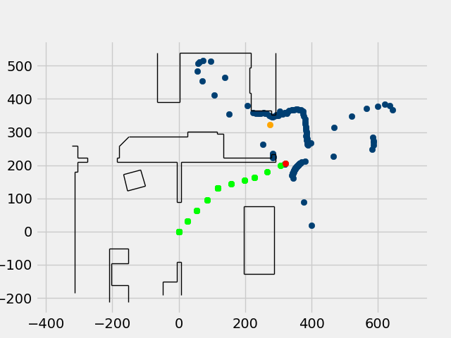  
Leg 4  
Starting Coords: (322, 205)  
Turning Left 90.0 deg to heading -111.94  
Heading after turn: -108.47 deg.  
Distance to target: 127.0 cm.  
Distance driven: 129 cm.  
Heading after drive: -108.81 deg.  
Ending Coords: (279, 326)  
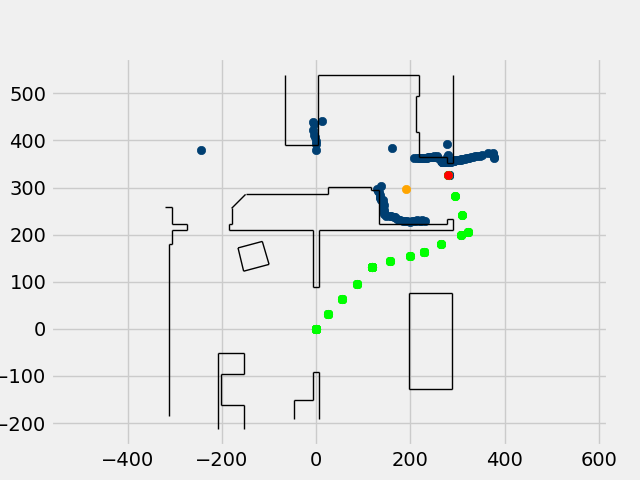  
Leg 5  
Starting Coords: (279, 326)  
Turning Left 90.0 deg to heading -198.79000000000002  
Heading after turn: 161.45000000000002 deg.  
Distance to target: 94.0 cm.  
Distance driven: 84 cm.  
Heading after drive: 161.48 deg.  
Ending Coords: (201, 297)  
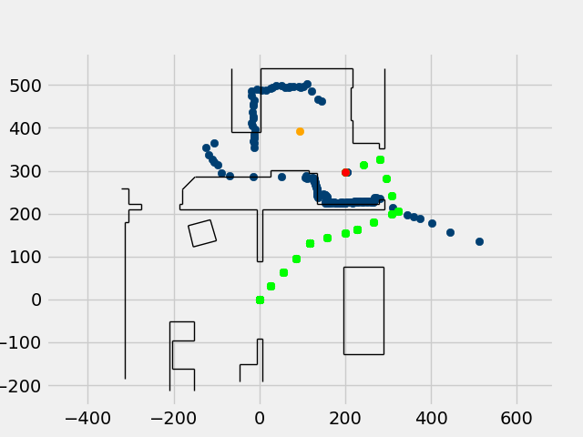  
Leg 6  
Starting Coords: (201, 297)  
Turning Right 59.99999999999999 deg to heading 221.5  
Heading after turn: -140.25 deg.  
Distance to target: 142.0 cm.  
Distance driven: 143 cm.  
Heading after drive: -137.70000000000002 deg.  
Ending Coords: (91, 389)  
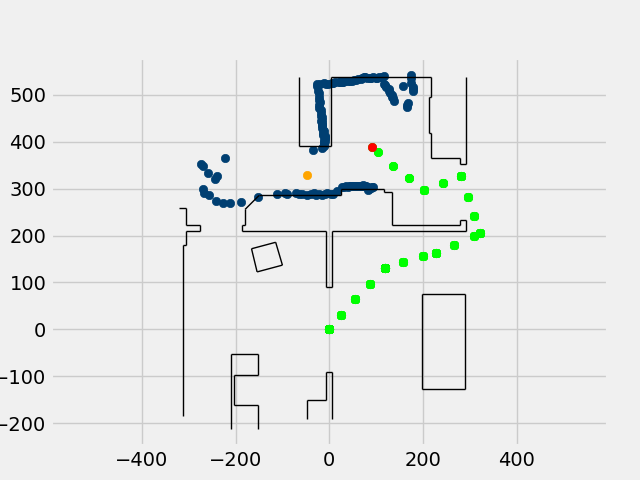  
Leg 7  
Starting Coords: (91, 389)  
Turning Left 66.0 deg to heading -203.66  
Heading after turn: 156.94 deg.  
Distance to target: 152.0 cm.  
Distance driven: 146 cm.  
Heading after drive: 158.76 deg.  
Ending Coords: (-40, 326)  
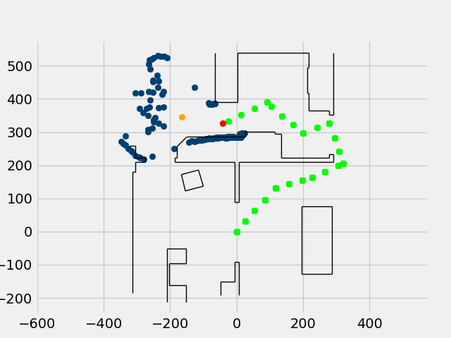  
Leg 8  
Starting Coords: (-40, 326)  
Turning Right 29.999999999999996 deg to heading 188.75  
Heading after turn: -173.33 deg.  
Distance to target: 125.0 cm.  
Distance driven: 128 cm.  
Heading after drive: -170.89000000000001 deg.  
Ending Coords: (-167, 342)  
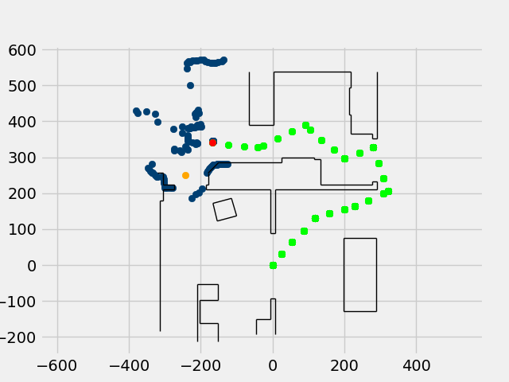  
Leg 9  
Starting Coords: (-167, 342)  
Turning Left 59.99999999999999 deg to heading -230.86  
Heading after turn: 131.03 deg.  
Distance to target: 118.0 cm.  
Distance driven: 117 cm.  
Heading after drive: 129.8 deg.  
Ending Coords: (-242, 251)  
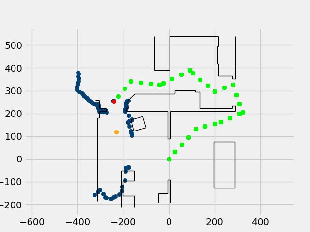  
Leg 10  
Starting Coords: (-242, 251)  
Turning Left 45.0 deg to heading 84.81  
Heading after turn: 88.05 deg.  
Distance to target: 134.0 cm.  
Distance driven: 130 cm.  
Heading after drive: 86.9 deg.  
Ending Coords: (-234, 121)  
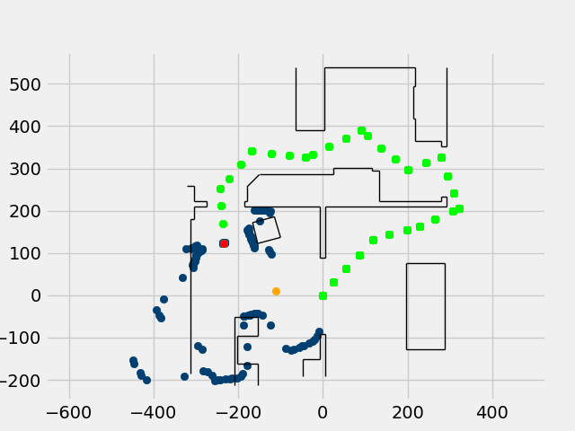  
Leg 11  
Starting Coords: (-234, 121)  
Turning Left 45.0 deg to heading 41.900000000000006  
Heading after turn: 42.5 deg.  
Distance to target: 166.0 cm.  
Distance driven: 164 cm.  
Heading after drive: 44.27 deg.  
Ending Coords: (-112, 11)  
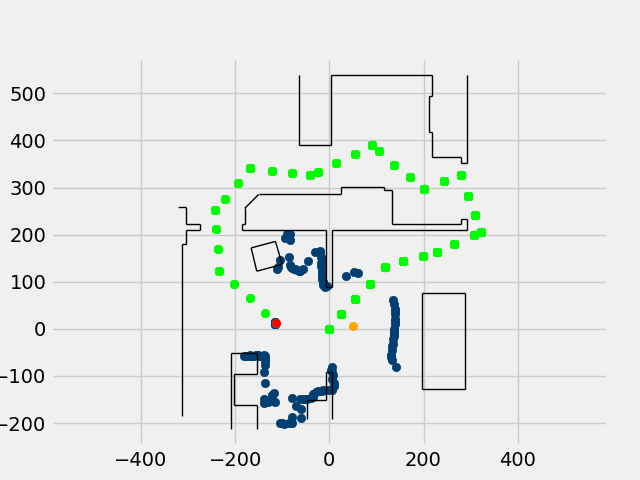  
Leg 12  
Starting Coords: (-112, 11)  
Turning Left 42.0 deg to heading 2.240000000000002  
Heading after turn: 1.0 deg.  
Distance to target: 164.0 cm.  
Distance driven: 161 cm.  
Heading after drive: 1.02 deg.  
Ending Coords: (48, 15)  
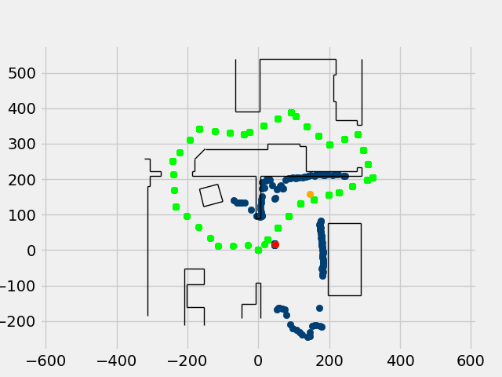  
Leg 13  
Starting Coords: (48, 15)  
